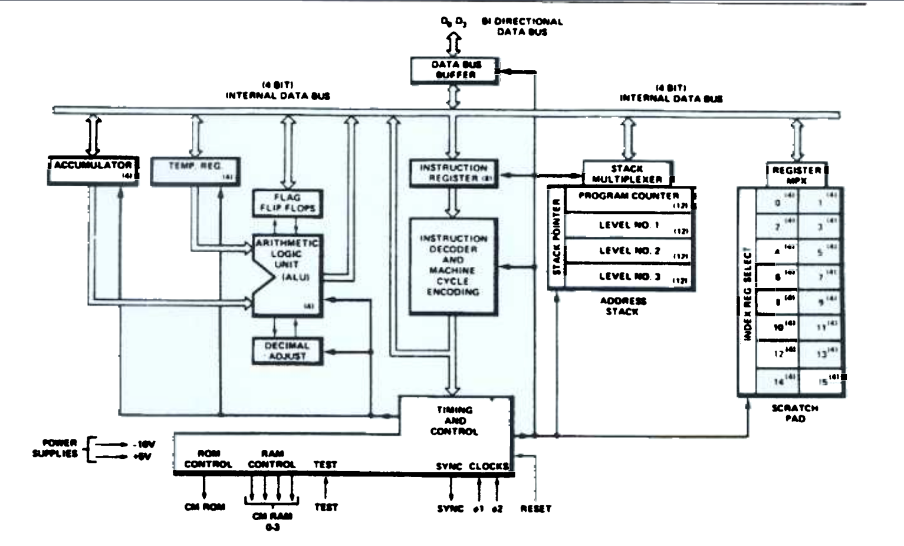
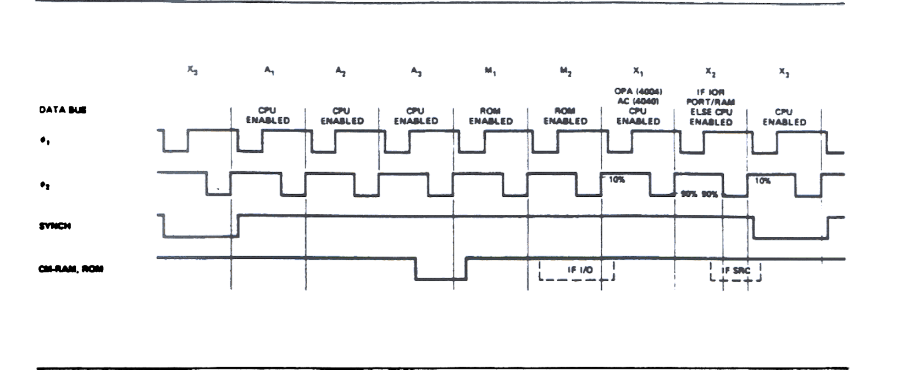

# 4004 SINGLE CHIP 4-BIT P-CHANNEL MICROPROCESSOR

- 4-bit Parallel CPU With 46 Instructions
- Instruction Set Includes Conditional Branching, Jump to Subroutine and Indirect Fetching
- Binary and Decimal Arithmetic Modes
- 10.8 Microsecond Instruction Cycle
- CPU Directly Compatible With MCS-40 ROMs and RAMs
- Easy Expansion - One CPU can Directly Drive up to 32.768 Bits of ROM and up to 5120 Bits of RAM
- Standard Operating Temperature Range of 0\*C to 70\*C
- Also Available With -40\*C to +85\*C Operating Range

The Intel 4004 is a complete 4-bit parallel central processing unit (CPU). The 4004 easily interfaces with keyboards, switches, displays, A-D converters, printers and other peripheral equipment.

The CPU can directly access 4K 8-bit instruction words of program memory and 5120 bits of data storage RAM. Sixteen index registers are provided for temprary data storage. Up to 16 4-bit input ports and 16 4-bit output ports may also be directly addressed.

The 4004 is fabricated with P-channel silicon gas MOS technology.



## Pin Description

D_0 - D_3

BIDIRECTIONAL DATA BUS. All address and data communication between the processor and the RAM and ROM chips occurs on these 4 lines.

RESET

RESET input. A logic "1" level at this input clears all flags and status registers and forces the progam counter to zero. To completely clear all adress and index registers, RESET must be applied for 64 clock cycles (8 machine cycles).

TEST

TEST input. The logical state of this signal may be tested with the JCN instruction.

SYNC

SYNC output. Synchronization signal generated by the processor and set to the ROM and RAM chips. It indicates the beginning of an instruction cycle.

CM-ROM

CM-ROM output. This is the ROM selection signal sent out by the processor when data is required from program memory.

CM-RAM_0 - CM-RAM_3

CM-RAM outputs. These are the bank selection signals for the 4002 RAM chips in the system.

O_1, O_2

Two phase clock inputs.

V_SS

Most positive voltage.

V_DD

V_SS - 15 +-5% main supply voltage.

## Instruction Set Format

### A. Machine Instructions

- 1 word instruction - 8-bits requiring 8 clock periods (instruction cycle).
- 2 word instruction - 16-bis requiring 16 clock periods (2 instruction cycles).

Each instruction is divided into two four-bit fields. The upper 4-bits is the OPR field containing the operation code. The lower 4-bits is the OPA field containing the modifier. For two word instructions, the second word contains address information or data.

The upper 4-bits (OPR) will always be fetched before the lower 4-bits (OPA) during M_1 and M_2 times respectively.

```
ONE WORD INSTRUCTIONS

| D3 | D2 | D1 | D0 | D3 | D2 | D1 | D0 |
|  x |  x |  x |  x |  x |  x |  x |  x |
|        OPR        |       OPA         |
|      OP CODE      |     MODIFIER      |

                    INDEX REGISTER ADDRESS
|  x |  x |  x |  x |  R |  R |  R |  R |

                    INDEX REGISTER PAIR ADDRESS
|  x |  x |  x |  x |  R |  R |  R |  x |

                    DATA
|  x |  x |  x |  x |  D |  D |  D |  D |


TWO WORD INSTRUCTIONS

1st INSTRUCTION CYCLE                               2nd INSTRUCTION CYCLE

| D3 | D2 | D1 | D0 | D3 | D2 | D1 | D0 |           | D3 | D2 | D1 | D0 | D3 | D2 | D1 | D0 |
|  x |  x |  x |  x |  x |  x |  x |  x |           |  x |  x |  x |  x |  x |  x |  x |  x |
|        OPR        |       OPA         |           |        OPR        |       OPA         |
|      OP CODE      |     MODIFIER      |           |      OP CODE      |     MODIFIER      |

                    UPPER ADDRESS                   MIDDLE ADDRESS      LOWER ADDRESS
|  x |  x |  x |  x | A3 | A3 | A3 | A3 |           | A2 | A2 | A2 | A2 | A1 | A1 | A1 | A1 |

                    CONDITION                       MIDDLE ADDRESS      LOWER ADDRESS
|  x |  x |  x |  x | C3 | C2 | C1 | C0 |           | A2 | A2 | A2 | A2 | A1 | A1 | A1 | A1 |

                    INDEX REGISTER ADDRESS          MIDDLE ADDRESS      LOWER ADDRESS
|  x |  x |  x |  x |  R |  R |  R |  R |           | A2 | A2 | A2 | A2 | A1 | A1 | A1 | A1 |

                    INDEX REGISTER PAIR ADDRESS     UPPER DATA          LOWER DATA
|  x |  x |  x |  x |  R |  R |  R |  x |           | D2 | D2 | D2 | D2 | D1 | D1 | D1 | D1 |
```
Table 1. Machine Instruction Format

### B. Input/Output and RAM Instructions and Accumulator Group Instructions

In these instructions (which are all single word) the OPR contains a 4-bit code which identifies either the I/O instruction or the accumulator group instruction and the OPA contains a 4-bit code which identifies the operation to be performed. Table II illustrates the contents of each 4-bit field.

```
| D3 | D2 | D1 | D0 | D3 | D2 | D1 | D0 |
|  x |  x |  x |  x |  x |  x |  x |  x |
|        OPR        |       OPA         |

INPUT/OUTPUT & RAM INSTRUCTIONS
|  1 |  1 |  1 |  0 |  x |  x |  x |  x |

ACCUMULATOR GROUP INSTRUCTIONS
|  1 |  1 |  1 |  1 |  x |  x |  x |  x |

WHERE x EITHER A "0" OR A "1"
```
Table II. I/O and Accumulator Group Instruction Formats

## 4004 Instruction Set

### BASIC INSTRUCTIONS (\* = 2 Word Instructions)

```
HEX     MNEMONIC    OPR         OPA         DESCRIPTION OF OPERATION

00      NOP         0 0 0 0     0 0 0 0     No operation.

1-      * JCN       0 0 0 1     C1C2C3C4    Jump to ROM address A2A2A2A2 A1A1A1A1 (within the same
--                  A2A2A2A2    A1A1A1A1    ROM that contains this JCN instruction) if condition
                                            C1C2C3C4 is true, otherwise go to the next instruction
                                            in sequence

2-      * FIM       0 0 1 0     R R R 0     Fetch immediate (direct) from ROM Data D2D2D2D2 D1D1D1D1
--                  D2D2D2D2    D1D1D1D1    to index register pair location RRR

3 -     FIN         0 0 1 1     R R R 0     Fetch indirect from ROM. Send contents of index register
                                            pair location 0 out as an address. Data fetched is
                                            placed into register pair location RRR

3-      JIN         0 0 1 1     R R R 1     Jump indirect. Send contents of register pair RRR out
                                            as an address at A1 and A2 time in the instruction cycle

4-      * JUN       0 1 0 0     A3A3A3A3    Jump unconditional to ROM address A3A3A3A3 A2A2A2A2
--                  A2A2A2A2    A1A1A1A1    A1A1A1A1

5-      * JMS       0 1 0 1     A3A3A3A3    Jump to subroutine ROM address A3A3A3A3 A2A2A2A2
--                  A2A2A2A2    A1A1A1A1    A1A1A1A1, save old address (up 1 level in stack)

6-      INC         0 1 1 0     R R R R     Increment contents of register RRRR

7-      * ISZ       0 1 1 1     R R R R     Increment contants of register RRRR. Go to ROM address
--                  A2A2A2A2    A1A1A1A1    A2A2A2A2 A1A1A1A1 (within the same ROM that contains
                                            this ISZ instruction) if result != 0, otherwise go to
                                            the next instruction in sequence

8-      ADD         1 0 0 0     R R R R     Add constants of register RRRR to accumulator with carry

9-      SUB         1 0 0 1     R R R R     Subtract contents of register RRR to accumulator with
                                            borrow

A-      LD          1 0 1 0     R R R R     Load contents of register RRRR to accumulator

B-      XCH         1 0 1 1     R R R R     Exchange contents of index register RRRR and accumulator

C-      BBL         1 1 0 0     D D D D     Branch back (down 1 level in stack) and load data DDDD
                                            to accumulator

D-      LDM         1 1 0 1     D D D D     Load data DDDD to accumulator

F0      CLB         1 1 1 1     0 0 0 0     Clear both (Accumulator and carry)

F1      CLC         1 1 1 1     0 0 0 1     Clear carry

F2      IAC         1 1 1 1     0 0 1 0     Increment accumulator

F3      CMC         1 1 1 1     0 0 1 1     Complement carry


F5      RAL         1 1 1 1     0 1 0 1     Rotate left (Accumulator and carry)

F6      RAR         1 1 1 1     0 1 1 0     Rotate right (Accumulator and carry)

F7      TCC         1 1 1 1     0 1 1 1     Transmit carry to accumulator and clear carry

F8      DAC         1 1 1 1     1 0 0 0     Decrement accumulator

F9      TCS         1 1 1 1     1 0 0 1     Transfer carry subtract and clear carry

FA      STC         1 1 1 1     1 0 1 0     Set carry

FB      DAA         1 1 1 1     1 0 1 1     Decimal adjust accumulator

FC      KBP         1 1 1 1     1 1 0 0     Keyboard process. Converts the contents of the
                                            accumulator from a one out of four code to a binary code

FD      DCL         1 1 1 1     1 1 0 1     Designate command line
```

## 4001/4002/4008/4009/4289

### INPUT/OUTPUT AND RAM INSTRUCTIONS

```
HEX     MNEMONIC    OPR         OPA         DESCRIPTION OF OPERATION

2-      SRC         0 0 1 0     R R R 1     Send register control. Send the address (contents of
                                            index register pair RRR) to ROM and RAM at X2 and X3
                                            time in the instruction cycle

E0      WRM         1 1 1 0     0 0 0 0     Write the contents of the accumulator into the
                                            previously selected RAM main memory character

E1      WMP         1 1 1 0     0 0 0 1     Write the contents of the accumulator into the
                                            previously selected RAM output port (Output Lines)

E2      WRR         1 1 1 0     0 0 1 0     Write the contents of the accumulator into the
                                            previously selected ROM output port (I/O Lines)

E3      WPM         1 1 1 0     0 0 1 1     Write the contents of the accumulator into the
                                            previously selected half byte of read/write program
                                            memory (used with 4008/4009 or 4289 only)

E4      WR0         1 1 1 0     0 1 0 0     Write the contents of the accumulator into the
                                            previously selected RAM status character 0

E5      WR1         1 1 1 0     0 1 0 1     Write the contents of the accumulator into the
                                            previously selected RAM status character 1

E6      WR2         1 1 1 0     0 1 1 0     Write the contents of the accumulator into the
                                            previously selected RAM status character 2

E7      WR3         1 1 1 0     0 1 1 1     Write the contents of the accumulator into the
                                            previously selected RAM status character 3

E8      SBM         1 1 1 0     1 0 0 0     Subtract the previously selected RAM main memory
                                            character from the accumulator with borrow

E9      RDM         1 1 1 0     1 0 0 1     Read the previously selected RAM main memory character
                                            into the accumulator

EA      RDR         1 1 1 0     1 0 1 0     Read the contents of the previously selected ROM input
                                            port into the accumulator (I/O Lines)

EB      ADM         1 1 1 0     1 0 1 1     Add the previously selected RAM main memory character
                                            to accumulator with carry

EC      RD0         1 1 1 0     1 1 0 0     Read the previously selected RAM status character 0
                                            into accumulator

ED      RD1         1 1 1 0     1 1 0 1     Read the previously selected RAM status character 1
                                            into accumulator

EE      RD2         1 1 1 0     1 1 1 0     Read the previously selected RAM status character 2
                                            into accumulator

EF      RD3         1 1 1 0     1 1 1 1     Read the previously selected RAM status character 3
                                            into accumulator

```

## 4004 Instruction Codes

```
HEX     MNEMONIC

00      -
01      -
02      -
03      -
04      -
05      -
06      -
07      -
08      -
09      -
0A      -
0B      -
0C      -
0D      -
0E      -
0F      -

10      JCN     CN=0
11      JCN     CN=1 also JNT
12      JCN     CN=2 also JC
13      JCN     CN=3
14      JCN     CN=4 also JZ
15      JCN     CN=5
16      JCN     CN=6
17      JCN     CN=7
18      JCN     CN=8
19      JCN     CN=9 also JT
1A      JCN     CN=10 also JNC
1B      JCN     CN=11
1C      JCN     CN=12 also JNZ
1D      JCN     CN=13
1E      JCN     CN=14
1F      JCN     CN=15

20      FIM     0
21      SRC     0
22      FIM     2
23      SRC     2
24      FIM     4
25      SRC     4
26      FIM     6
27      SRC     6
28      FIM     8
29      SRC     8
2A      FIM     10
2B      SRC     10
2C      FIM     12
2D      SRC     12
2E      FIM     14
2F      SRC     14

30      FIN     0
31      JIN     0
32      FIN     2
33      JIN     2
34      FIN     4
35      JIN     4
36      FIN     6
37      JIN     6
38      FIN     8
39      JIN     8
3A      FIN     10
3B      JIN     10
3C      FIN     12
3D      JIN     12
3E      FIN     14
3F      JIN     14

; Second hex digit is
; part of jump address
40      JUN
41      JUN
42      JUN
43      JUN
44      JUN
45      JUN
46      JUN
47      JUN
48      JUN
49      JUN
4A      JUN
4B      JUN
4C      JUN
4D      JUN
4E      JUN
4F      JUN

; Second hex digit is
; part of jump address
50      JMS
51      JMS
52      JMS
53      JMS
54      JMS
55      JMS
56      JMS
57      JMS
58      JMS
59      JMS
5A      JMS
5B      JMS
5C      JMS
5D      JMS
5E      JMS
5F      JMS

60      INC     0
61      INC     1
62      INC     2
63      INC     3
64      INC     4
65      INC     5
66      INC     6
67      INC     7
68      INC     8
69      INC     9
6A      INC     10
6B      INC     11
6C      INC     12
6D      INC     13
6E      INC     14
6F      INC     15

70      ISZ     0
71      ISZ     1
72      ISZ     2
73      ISZ     3
74      ISZ     4
75      ISZ     5
76      ISZ     6
77      ISZ     7
78      ISZ     8
79      ISZ     9
7A      ISZ     10
7B      ISZ     11
7C      ISZ     12
7D      ISZ     13
7E      ISZ     14
7F      ISZ     15

80      ADD     0
81      ADD     1
82      ADD     2
83      ADD     3
84      ADD     4
85      ADD     5
86      ADD     6
87      ADD     7
88      ADD     8
89      ADD     9
8A      ADD     10
8B      ADD     11
8C      ADD     12
8D      ADD     13
8E      ADD     14
8F      ADD     15

90      SUB     0
91      SUB     1
92      SUB     2
93      SUB     3
94      SUB     4
95      SUB     5
96      SUB     6
97      SUB     7
98      SUB     8
99      SUB     9
9A      SUB     10
9B      SUB     11
9C      SUB     12
9D      SUB     13
9E      SUB     14
9F      SUB     15

A0      LD     0
A1      LD     1
A2      LD     2
A3      LD     3
A4      LD     4
A5      LD     5
A6      LD     6
A7      LD     7
A8      LD     8
A9      LD     9
AA      LD     10
AB      LD     11
AC      LD     12
AD      LD     13
AE      LD     14
AF      LD     15

B0      XCH     0
B1      XCH     1
B2      XCH     2
B3      XCH     3
B4      XCH     4
B5      XCH     5
B6      XCH     6
B7      XCH     7
B8      XCH     8
B9      XCH     9
BA      XCH     10
BB      XCH     11
BC      XCH     12
BD      XCH     13
BE      XCH     14
BF      XCH     15

C0      BLL     0
C1      BLL     1
C2      BLL     2
C3      BLL     3
C4      BLL     4
C5      BLL     5
C6      BLL     6
C7      BLL     7
C8      BLL     8
C9      BLL     9
CA      BLL     10
CB      BLL     11
CC      BLL     12
CD      BLL     13
CE      BLL     14
CF      BLL     15

D0      LDM     0
D1      LDM
D2      LDM     2
D3      LDM     3
D4      LDM     4
D5      LDM     5
D6      LDM     6
D7      LDM     7
D8      LDM     8
D9      LDM     9
DA      LDM     10
DB      LDM     11
DC      LDM     12
DD      LDM     13
DE      LDM     14
DF      LDM     15

E0      WRP
E1      WMP
E2      WRR
E3      WPM
E4      WR0
E5      WR1
E6      WR2
E7      WR3
E8      SBM
E9      RDM
EA      RDR
EB      ADM
EC      RD0
ED      RD1
EE      RD2
EF      RD3

F0      CLB
F1      CLC
F2      IAC
F3      CMC
F4      CMA
F5      RAL
F6      RAR
F7      TCC
F8      DAC
F9      TCS
FA      STC
FB      DAA
FC      KBP
FD      DCL
FE      -
FF      -
```




Figure 1. Timing Diagram
